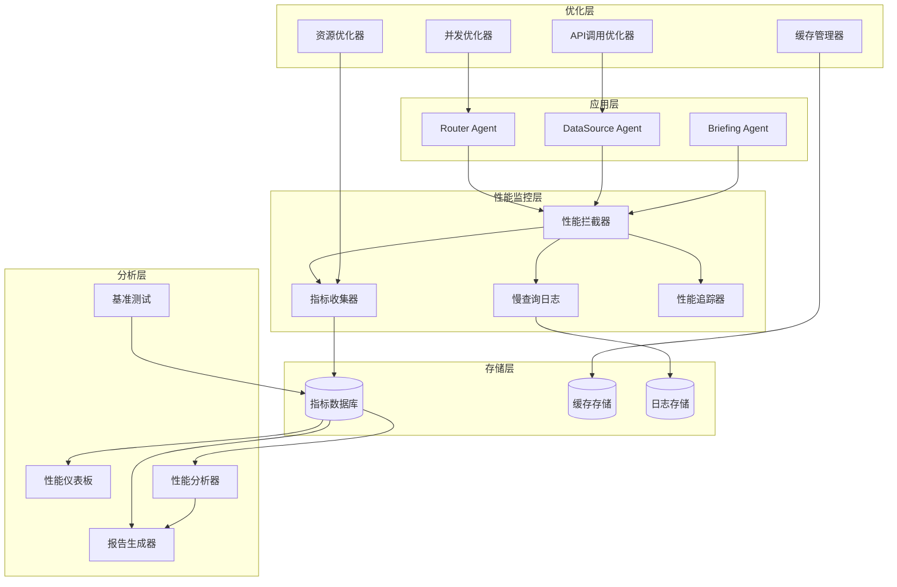

# Design Document: 性能优化 (Performance Optimization)

## Overview

性能优化模块为小游探MVP系统提供全面的性能监控、优化和基准测试能力。设计原则：

- **非侵入式监控**：最小化对现有代码的影响
- **实时性能追踪**：提供即时的性能反馈
- **智能缓存策略**：平衡内存使用和响应速度
- **并发优化**：充分利用异步编程提升吞吐量
- **可观测性**：提供丰富的性能指标和可视化

## Architecture

### 性能优化架构图



### 核心设计决策

1. **装饰器模式**：使用装饰器实现非侵入式性能监控
2. **异步优先**：全面采用async/await提升并发性能
3. **分层缓存**：内存缓存 + 持久化缓存的两层策略
4. **指标标准化**：使用Prometheus指标格式便于集成
5. **智能优化**：基于运行时数据自动调整优化策略

## Components and Interfaces

### 1. 性能拦截器 (Performance Interceptor)

**功能**：透明地拦截Agent调用，收集性能数据

```python
import time
import functools
from typing import Callable, Any
from dataclasses import dataclass
from datetime import datetime

@dataclass
class PerformanceMetrics:
    operation: str
    start_time: datetime
    end_time: datetime
    duration_ms: float
    success: bool
    error: Optional[str] = None
    metadata: Dict[str, Any] = None

class PerformanceInterceptor:
    def __init__(self, metrics_collector: 'MetricsCollector'):
        self.metrics_collector = metrics_collector
        self.slow_query_threshold_ms = 1000  # 1秒
    
    def monitor(self, operation_name: str):
        """装饰器：监控函数性能"""
        def decorator(func: Callable) -> Callable:
            @functools.wraps(func)
            async def async_wrapper(*args, **kwargs):
                start_time = datetime.now()
                start_perf = time.perf_counter()
                success = True
                error = None
                
                try:
                    result = await func(*args, **kwargs)
                    return result
                except Exception as e:
                    success = False
                    error = str(e)
                    raise
                finally:
                    end_time = datetime.now()
                    duration_ms = (time.perf_counter() - start_perf) * 1000
                    
                    metrics = PerformanceMetrics(
                        operation=operation_name,
                        start_time=start_time,
                        end_time=end_time,
                        duration_ms=duration_ms,
                        success=success,
                        error=error,
                        metadata={"args": str(args), "kwargs": str(kwargs)}
                    )
                    
                    await self.metrics_collector.record(metrics)
                    
                    if duration_ms > self.slow_query_threshold_ms:
                        await self.log_slow_query(metrics)
            
            @functools.wraps(func)
            def sync_wrapper(*args, **kwargs):
                # 同步函数版本
                start_time = datetime.now()
                start_perf = time.perf_counter()
                success = True
                error = None
                
                try:
                    result = func(*args, **kwargs)
                    return result
                except Exception as e:
                    success = False
                    error = str(e)
                    raise
                finally:
                    end_time = datetime.now()
                    duration_ms = (time.perf_counter() - start_perf) * 1000
                    
                    metrics = PerformanceMetrics(
                        operation=operation_name,
                        start_time=start_time,
                        end_time=end_time,
                        duration_ms=duration_ms,
                        success=success,
                        error=error
                    )
                    
                    # 同步记录
                    self.metrics_collector.record_sync(metrics)
                    
                    if duration_ms > self.slow_query_threshold_ms:
                        self.log_slow_query_sync(metrics)
            
            # 根据函数类型返回对应的wrapper
            if asyncio.iscoroutinefunction(func):
                return async_wrapper
            else:
                return sync_wrapper
        
        return decorator
    
    async def log_slow_query(self, metrics: PerformanceMetrics):
        """记录慢查询"""
        logger.warning(
            f"Slow query detected: {metrics.operation} took {metrics.duration_ms:.2f}ms",
            extra={"metrics": metrics}
        )
```

### 2. 指标收集器 (Metrics Collector)

**功能**：收集、聚合和存储性能指标

```python
from collections import defaultdict
from typing import List, Dict
import asyncio

class MetricsCollector:
    def __init__(self):
        self.metrics_buffer: List[PerformanceMetrics] = []
        self.buffer_lock = asyncio.Lock()
        self.aggregated_metrics: Dict[str, AggregatedMetrics] = defaultdict(AggregatedMetrics)
        self.flush_interval = 60  # 每60秒刷新一次
    
    async def record(self, metrics: PerformanceMetrics):
        """记录性能指标"""
        async with self.buffer_lock:
            self.metrics_buffer.append(metrics)
            self._update_aggregated_metrics(metrics)
        
        # 如果缓冲区满了，触发刷新
        if len(self.metrics_buffer) >= 100:
            await self.flush()
    
    def _update_aggregated_metrics(self, metrics: PerformanceMetrics):
        """更新聚合指标"""
        agg = self.aggregated_metrics[metrics.operation]
        agg.total_count += 1
        agg.total_duration_ms += metrics.duration_ms
        agg.min_duration_ms = min(agg.min_duration_ms, metrics.duration_ms)
        agg.max_duration_ms = max(agg.max_duration_ms, metrics.duration_ms)
        
        if metrics.success:
            agg.success_count += 1
        else:
            agg.error_count += 1
    
    async def flush(self):
        """刷新指标到持久化存储"""
        async with self.buffer_lock:
            if not self.metrics_buffer:
                return
            
            metrics_to_flush = self.metrics_buffer.copy()
            self.metrics_buffer.clear()
        
        # 异步写入数据库或文件
        await self._persist_metrics(metrics_to_flush)
    
    async def get_metrics_summary(self, operation: Optional[str] = None) -> Dict:
        """获取指标摘要"""
        if operation:
            agg = self.aggregated_metrics.get(operation)
            if not agg:
                return {}
            return agg.to_dict()
        
        return {
            op: agg.to_dict() 
            for op, agg in self.aggregated_metrics.items()
        }

@dataclass
class AggregatedMetrics:
    total_count: int = 0
    success_count: int = 0
    error_count: int = 0
    total_duration_ms: float = 0
    min_duration_ms: float = float('inf')
    max_duration_ms: float = 0
    
    @property
    def avg_duration_ms(self) -> float:
        return self.total_duration_ms / self.total_count if self.total_count > 0 else 0
    
    @property
    def success_rate(self) -> float:
        return self.success_count / self.total_count if self.total_count > 0 else 0
    
    def to_dict(self) -> Dict:
        return {
            "total_count": self.total_count,
            "success_count": self.success_count,
            "error_count": self.error_count,
            "avg_duration_ms": self.avg_duration_ms,
            "min_duration_ms": self.min_duration_ms,
            "max_duration_ms": self.max_duration_ms,
            "success_rate": self.success_rate
        }
```

### 3. 缓存管理器 (Cache Manager)

**功能**：智能缓存管理，提升响应速度

```python
from typing import Optional, Any, Callable
import hashlib
import json
from datetime import datetime, timedelta

class CacheManager:
    def __init__(self, max_size: int = 1000, default_ttl: int = 300):
        self.cache: Dict[str, CacheEntry] = {}
        self.max_size = max_size
        self.default_ttl = default_ttl  # 默认5分钟过期
        self.hits = 0
        self.misses = 0
    
    def _generate_key(self, operation: str, *args, **kwargs) -> str:
        """生成缓存键"""
        key_data = {
            "operation": operation,
            "args": args,
            "kwargs": kwargs
        }
        key_str = json.dumps(key_data, sort_keys=True)
        return hashlib.md5(key_str.encode()).hexdigest()
    
    async def get(self, operation: str, *args, **kwargs) -> Optional[Any]:
        """获取缓存"""
        key = self._generate_key(operation, *args, **kwargs)
        entry = self.cache.get(key)
        
        if entry is None:
            self.misses += 1
            return None
        
        # 检查是否过期
        if datetime.now() > entry.expires_at:
            del self.cache[key]
            self.misses += 1
            return None
        
        self.hits += 1
        entry.last_accessed = datetime.now()
        return entry.value
    
    async def set(self, operation: str, value: Any, ttl: Optional[int] = None, 
                  *args, **kwargs):
        """设置缓存"""
        key = self._generate_key(operation, *args, **kwargs)
        
        # 如果缓存满了，使用LRU淘汰
        if len(self.cache) >= self.max_size:
            self._evict_lru()
        
        ttl = ttl or self.default_ttl
        entry = CacheEntry(
            value=value,
            created_at=datetime.now(),
            expires_at=datetime.now() + timedelta(seconds=ttl),
            last_accessed=datetime.now()
        )
        
        self.cache[key] = entry
    
    def _evict_lru(self):
        """淘汰最少使用的缓存项"""
        if not self.cache:
            return
        
        lru_key = min(
            self.cache.keys(),
            key=lambda k: self.cache[k].last_accessed
        )
        del self.cache[lru_key]
    
    async def invalidate(self, operation: str, *args, **kwargs):
        """失效缓存"""
        key = self._generate_key(operation, *args, **kwargs)
        if key in self.cache:
            del self.cache[key]
    
    async def clear(self):
        """清空所有缓存"""
        self.cache.clear()
        self.hits = 0
        self.misses = 0
    
    @property
    def hit_rate(self) -> float:
        """缓存命中率"""
        total = self.hits + self.misses
        return self.hits / total if total > 0 else 0
    
    def get_stats(self) -> Dict:
        """获取缓存统计"""
        return {
            "size": len(self.cache),
            "max_size": self.max_size,
            "hits": self.hits,
            "misses": self.misses,
            "hit_rate": self.hit_rate
        }

@dataclass
class CacheEntry:
    value: Any
    created_at: datetime
    expires_at: datetime
    last_accessed: datetime
```

### 4. 并发优化器 (Concurrency Optimizer)

**功能**：优化Agent并发执行

```python
import asyncio
from typing import List, Callable, Any, Dict

class ConcurrencyOptimizer:
    def __init__(self, max_concurrent: int = 10):
        self.max_concurrent = max_concurrent
        self.semaphore = asyncio.Semaphore(max_concurrent)
    
    async def execute_concurrent(
        self, 
        tasks: List[Callable],
        timeout: Optional[float] = None
    ) -> List[Any]:
        """并发执行多个任务"""
        async def bounded_task(task: Callable):
            async with self.semaphore:
                return await task()
        
        # 创建所有任务
        coroutines = [bounded_task(task) for task in tasks]
        
        # 并发执行，支持超时
        if timeout:
            results = await asyncio.wait_for(
                asyncio.gather(*coroutines, return_exceptions=True),
                timeout=timeout
            )
        else:
            results = await asyncio.gather(*coroutines, return_exceptions=True)
        
        return results
    
    async def execute_with_dependencies(
        self,
        task_graph: Dict[str, Dict]
    ) -> Dict[str, Any]:
        """执行有依赖关系的任务图"""
        results = {}
        completed = set()
        
        async def can_execute(task_id: str) -> bool:
            """检查任务的依赖是否都已完成"""
            deps = task_graph[task_id].get("dependencies", [])
            return all(dep in completed for dep in deps)
        
        async def execute_task(task_id: str):
            """执行单个任务"""
            task_info = task_graph[task_id]
            task_func = task_info["func"]
            
            # 获取依赖任务的结果
            dep_results = {
                dep: results[dep] 
                for dep in task_info.get("dependencies", [])
            }
            
            # 执行任务
            result = await task_func(dep_results)
            results[task_id] = result
            completed.add(task_id)
        
        # 循环执行直到所有任务完成
        while len(completed) < len(task_graph):
            # 找出所有可以执行的任务
            ready_tasks = [
                task_id for task_id in task_graph.keys()
                if task_id not in completed and await can_execute(task_id)
            ]
            
            if not ready_tasks:
                raise RuntimeError("Circular dependency detected in task graph")
            
            # 并发执行所有就绪的任务
            await asyncio.gather(*[execute_task(tid) for tid in ready_tasks])
        
        return results
```

### 5. 资源监控器 (Resource Monitor)

**功能**：监控系统资源使用情况

```python
import psutil
import asyncio
from dataclasses import dataclass
from typing import Optional

@dataclass
class ResourceMetrics:
    cpu_percent: float
    memory_percent: float
    memory_used_mb: float
    memory_available_mb: float
    disk_usage_percent: float
    network_sent_mb: float
    network_recv_mb: float
    timestamp: datetime

class ResourceMonitor:
    def __init__(self, check_interval: int = 30):
        self.check_interval = check_interval
        self.metrics_history: List[ResourceMetrics] = []
        self.max_history = 1000
        self.monitoring = False
        self._monitor_task: Optional[asyncio.Task] = None
    
    async def start_monitoring(self):
        """开始监控"""
        if self.monitoring:
            return
        
        self.monitoring = True
        self._monitor_task = asyncio.create_task(self._monitor_loop())
    
    async def stop_monitoring(self):
        """停止监控"""
        self.monitoring = False
        if self._monitor_task:
            self._monitor_task.cancel()
            try:
                await self._monitor_task
            except asyncio.CancelledError:
                pass
    
    async def _monitor_loop(self):
        """监控循环"""
        while self.monitoring:
            metrics = await self.collect_metrics()
            self.metrics_history.append(metrics)
            
            # 限制历史记录大小
            if len(self.metrics_history) > self.max_history:
                self.metrics_history.pop(0)
            
            # 检查资源告警
            await self._check_alerts(metrics)
            
            await asyncio.sleep(self.check_interval)
    
    async def collect_metrics(self) -> ResourceMetrics:
        """收集当前资源指标"""
        # CPU使用率
        cpu_percent = psutil.cpu_percent(interval=1)
        
        # 内存使用
        memory = psutil.virtual_memory()
        memory_percent = memory.percent
        memory_used_mb = memory.used / (1024 * 1024)
        memory_available_mb = memory.available / (1024 * 1024)
        
        # 磁盘使用
        disk = psutil.disk_usage('/')
        disk_usage_percent = disk.percent
        
        # 网络IO
        net_io = psutil.net_io_counters()
        network_sent_mb = net_io.bytes_sent / (1024 * 1024)
        network_recv_mb = net_io.bytes_recv / (1024 * 1024)
        
        return ResourceMetrics(
            cpu_percent=cpu_percent,
            memory_percent=memory_percent,
            memory_used_mb=memory_used_mb,
            memory_available_mb=memory_available_mb,
            disk_usage_percent=disk_usage_percent,
            network_sent_mb=network_sent_mb,
            network_recv_mb=network_recv_mb,
            timestamp=datetime.now()
        )
    
    async def _check_alerts(self, metrics: ResourceMetrics):
        """检查资源告警"""
        if metrics.cpu_percent > 80:
            logger.warning(f"High CPU usage: {metrics.cpu_percent}%")
        
        if metrics.memory_percent > 85:
            logger.warning(f"High memory usage: {metrics.memory_percent}%")
        
        if metrics.disk_usage_percent > 90:
            logger.warning(f"High disk usage: {metrics.disk_usage_percent}%")
    
    def get_current_metrics(self) -> Optional[ResourceMetrics]:
        """获取最新的资源指标"""
        return self.metrics_history[-1] if self.metrics_history else None
    
    def get_average_metrics(self, minutes: int = 5) -> Optional[ResourceMetrics]:
        """获取指定时间段的平均指标"""
        if not self.metrics_history:
            return None
        
        cutoff_time = datetime.now() - timedelta(minutes=minutes)
        recent_metrics = [
            m for m in self.metrics_history 
            if m.timestamp > cutoff_time
        ]
        
        if not recent_metrics:
            return None
        
        return ResourceMetrics(
            cpu_percent=sum(m.cpu_percent for m in recent_metrics) / len(recent_metrics),
            memory_percent=sum(m.memory_percent for m in recent_metrics) / len(recent_metrics),
            memory_used_mb=sum(m.memory_used_mb for m in recent_metrics) / len(recent_metrics),
            memory_available_mb=sum(m.memory_available_mb for m in recent_metrics) / len(recent_metrics),
            disk_usage_percent=sum(m.disk_usage_percent for m in recent_metrics) / len(recent_metrics),
            network_sent_mb=sum(m.network_sent_mb for m in recent_metrics) / len(recent_metrics),
            network_recv_mb=sum(m.network_recv_mb for m in recent_metrics) / len(recent_metrics),
            timestamp=datetime.now()
        )
```

## Data Models

### 性能指标数据模型

```python
from enum import Enum
from typing import Optional, Dict, Any, List
from dataclasses import dataclass, field
from datetime import datetime

class MetricType(Enum):
    RESPONSE_TIME = "response_time"
    THROUGHPUT = "throughput"
    ERROR_RATE = "error_rate"
    CACHE_HIT_RATE = "cache_hit_rate"
    RESOURCE_USAGE = "resource_usage"

@dataclass
class PerformanceMetrics:
    """性能指标"""
    operation: str
    start_time: datetime
    end_time: datetime
    duration_ms: float
    success: bool
    error: Optional[str] = None
    metadata: Dict[str, Any] = field(default_factory=dict)

@dataclass
class CacheEntry:
    """缓存条目"""
    value: Any
    created_at: datetime
    expires_at: datetime
    last_accessed: datetime

@dataclass
class ResourceMetrics:
    """资源指标"""
    cpu_percent: float
    memory_percent: float
    memory_used_mb: float
    memory_available_mb: float
    disk_usage_percent: float
    network_sent_mb: float
    network_recv_mb: float
    timestamp: datetime

@dataclass
class BenchmarkResult:
    """基准测试结果"""
    test_name: str
    total_requests: int
    successful_requests: int
    failed_requests: int
    avg_response_time_ms: float
    min_response_time_ms: float
    max_response_time_ms: float
    p50_response_time_ms: float
    p95_response_time_ms: float
    p99_response_time_ms: float
    requests_per_second: float
    timestamp: datetime
    metadata: Dict[str, Any] = field(default_factory=dict)
```

