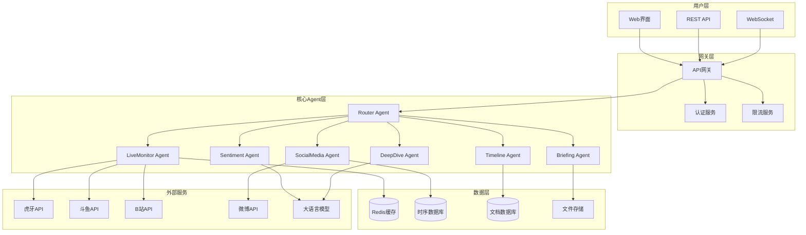

# Design Document: 小游探增强版开发路线图

## Overview

小游探（YouGame Explorer）增强版是基于当前基础版功能的全面升级方案。系统采用微服务架构和多Agent协作模式，通过渐进式开发策略实现从基础版到完整版的平滑演进。

核心设计原则：
- **渐进式开发**：每个阶段都能提供可用功能
- **模块化架构**：Agent间松耦合，支持独立开发和部署
- **多平台支持**：统一接口适配不同数据源
- **智能分析**：集成AI能力提供深度洞察
- **实时响应**：毫秒级数据处理和推送
- **高可用性**：容错机制和自动恢复

## Architecture

### 系统架构图



### 分层架构

1. **用户接口层**：Web界面、REST API、WebSocket实时通信
2. **网关层**：统一入口、认证授权、限流保护
3. **业务逻辑层**：各功能Agent，实现核心业务逻辑
4. **数据访问层**：多种数据存储，支持不同数据类型
5. **外部集成层**：第三方API适配器，统一接口标准

## Components and Interfaces

### 核心Agent组件

#### 1. Enhanced Router Agent
**功能扩展**：
- 智能意图识别（支持复杂查询）
- 多轮对话管理
- 上下文记忆
- 负载均衡分发

**接口定义**：
```python
class EnhancedRouterAgent:
    async def process_query(self, query: str, context: ConversationContext) -> Response
    async def route_to_agent(self, intent: Intent, entities: Dict) -> AgentResponse
    async def manage_conversation(self, session_id: str) -> ConversationState
```

#### 2. Multi-Platform LiveMonitor Agent
**新增功能**：
- 斗鱼平台支持
- B站直播支持
- 平台适配器模式
- 智能监控频率调整

**接口定义**：
```python
class MultiPlatformLiveMonitor:
    async def monitor_platform(self, platform: Platform, streamer: Streamer) -> LiveStatus
    async def aggregate_status(self, streamer_name: str) -> AggregatedStatus
    async def detect_platform_changes(self) -> List[PlatformChange]
```

#### 3. SocialMedia Agent（新增）
**核心功能**：
- 微博内容监控
- 关键词检测
- 媒体内容提取
- 重要性评级

**接口定义**：
```python
class SocialMediaAgent:
    async def monitor_weibo(self, user_id: str) -> List[WeiboPost]
    async def extract_keywords(self, content: str) -> List[Keyword]
    async def rate_importance(self, post: SocialPost) -> ImportanceLevel
```

#### 4. Sentiment Agent（新增）
**核心功能**：
- 情绪分析
- 趋势检测
- 热点识别
- 情绪报告生成

**接口定义**：
```python
class SentimentAgent:
    async def analyze_sentiment(self, content: str) -> SentimentResult
    async def detect_trends(self, time_range: TimeRange) -> List[SentimentTrend]
    async def identify_hotspots(self) -> List[HotspotEvent]
```

#### 5. Timeline Agent（新增）
**核心功能**：
- 事件时间线构建
- 关联关系分析
- 历史事件查询
- 影响力评估

**接口定义**：
```python
class TimelineAgent:
    async def build_timeline(self, events: List[Event]) -> Timeline
    async def analyze_relationships(self, entities: List[Entity]) -> RelationshipGraph
    async def query_history(self, query: HistoryQuery) -> List[HistoricalEvent]
```

#### 6. DeepDive Agent（新增）
**核心功能**：
- 深度报道生成
- 多源数据整合
- 背景分析
- 影响评估

**接口定义**：
```python
class DeepDiveAgent:
    async def generate_report(self, event: MajorEvent) -> DeepReport
    async def integrate_sources(self, sources: List[DataSource]) -> IntegratedData
    async def analyze_impact(self, event: Event) -> ImpactAnalysis
```

### 数据模型

#### 核心数据结构
```python
@dataclass
class StreamerProfile:
    name: str
    platforms: Dict[str, PlatformInfo]
    team: Optional[str]
    game_categories: List[str]
    priority_level: PriorityLevel

@dataclass
class MultiPlatformStatus:
    streamer: StreamerProfile
    platform_statuses: Dict[str, LiveStatus]
    aggregated_viewers: int
    primary_platform: str

@dataclass
class SocialMediaPost:
    platform: str
    user_id: str
    content: str
    media_urls: List[str]
    timestamp: datetime
    engagement_metrics: EngagementMetrics
    sentiment_score: float
    importance_level: ImportanceLevel

@dataclass
class GameEvent:
    event_id: str
    title: str
    description: str
    participants: List[str]
    timestamp: datetime
    event_type: EventType
    impact_score: float
    related_events: List[str]
```

## Correctness Properties

*A property is a characteristic or behavior that should hold true across all valid executions of a system-essentially, a formal statement about what the system should do. Properties serve as the bridge between human-readable specifications and machine-verifiable correctness guarantees.*

### Property Reflection

After reviewing all properties identified in the prework analysis, I've identified several areas where properties can be consolidated or where redundancy exists:

**Consolidation Opportunities:**
- Performance properties (response time requirements) can be grouped by similar time constraints
- Platform support properties can be combined into comprehensive multi-platform validation
- Notification properties share similar timing and delivery requirements
- Data storage and retrieval properties follow similar patterns

**Redundancy Elimination:**
- Multiple API failure handling properties can be unified into a comprehensive failover property
- Various content generation properties (briefings, reports, timelines) share similar completeness requirements
- User preference and personalization properties can be consolidated into comprehensive customization validation

### Core Properties

**Property 1: API Failover and Recovery**
*For any* external API failure, the system should automatically retry within 30 seconds, switch to backup methods when available, and maintain service continuity
**Validates: Requirements 1.1, 11.4**

**Property 2: Performance Response Times**
*For any* user query or system operation, response times should not exceed specified thresholds (5 seconds for briefings, 3 seconds for data queries, 30 seconds for deep analysis)
**Validates: Requirements 1.2, 5.4, 6.4, 10.4**

**Property 3: Multi-Platform Data Aggregation**
*For any* streamer configured across multiple platforms, the system should return aggregated status information including all platforms and combined metrics
**Validates: Requirements 2.3, 2.5**

**Property 4: Content Detection and Classification**
*For any* social media content or live stream data, the system should detect relevant keywords, classify importance levels, and extract media links when present
**Validates: Requirements 3.2, 3.4, 4.1**

**Property 5: Real-time Notification Delivery**
*For any* important event (stream start, major news), notifications should be delivered within specified time limits (2 minutes for streams, immediate for major events)
**Validates: Requirements 7.1, 7.2**

**Property 6: Personalization and Filtering**
*For any* user with configured preferences, the system should prioritize, filter, and customize content according to their settings
**Validates: Requirements 8.1, 8.3, 8.4**

**Property 7: Data Persistence and Integrity**
*For any* collected data, the system should store it in appropriate databases, maintain data integrity, and provide reliable retrieval within performance limits
**Validates: Requirements 10.1, 10.3, 10.4**

**Property 8: System Monitoring and Auto-Recovery**
*For any* system anomaly (high load, memory usage, API failures), the system should detect the issue, apply appropriate countermeasures, and log the events
**Validates: Requirements 11.2, 11.3, 11.5**

**Property 9: Configuration Validation and Management**
*For any* system startup or configuration change, all required settings should be validated, missing items reported, and environment-specific configurations applied correctly
**Validates: Requirements 1.3, 12.3**

**Property 10: Scalability and High Availability**
*For any* deployment scenario requiring scale or high availability, the system should support multi-instance deployment, load balancing, and zero-downtime updates
**Validates: Requirements 12.2, 12.4, 12.5**

## Error Handling

### 错误分类和处理策略

#### 1. 外部API错误
- **网络超时**：自动重试3次，指数退避
- **API限流**：切换到备用检测方法
- **数据格式变更**：使用适配器模式快速适配
- **服务不可用**：启用缓存数据，降级服务

#### 2. 数据处理错误
- **解析失败**：记录原始数据，跳过处理
- **格式验证失败**：使用默认值，记录警告
- **数据不一致**：触发数据修复流程

#### 3. 系统资源错误
- **内存不足**：清理缓存，触发垃圾回收
- **磁盘空间不足**：清理过期数据，压缩日志
- **CPU过载**：启用限流，降级非关键功能

#### 4. 用户输入错误
- **无效查询**：提供建议和示例
- **不存在的主播**：推荐相似主播
- **权限不足**：引导用户登录或升级

### 容错机制

```python
class ErrorHandler:
    async def handle_api_error(self, error: APIError) -> FallbackResponse:
        if error.is_timeout():
            return await self.retry_with_backoff()
        elif error.is_rate_limited():
            return await self.switch_to_backup()
        else:
            return await self.use_cached_data()
    
    async def handle_system_error(self, error: SystemError) -> RecoveryAction:
        if error.is_memory_issue():
            await self.cleanup_memory()
        elif error.is_disk_issue():
            await self.cleanup_storage()
        
        return RecoveryAction.CONTINUE
```

## Testing Strategy

### 双重测试方法

系统采用**单元测试**和**属性测试**相结合的综合测试策略：

- **单元测试**：验证具体示例、边界情况和错误条件
- **属性测试**：验证通用属性在所有输入下的正确性
- **集成测试**：验证Agent间协作和端到端流程
- **性能测试**：验证响应时间和吞吐量要求

### 属性测试配置

**测试框架**：使用 `hypothesis` 进行Python属性测试
**测试配置**：每个属性测试最少运行100次迭代
**标签格式**：`# Feature: yougame-enhanced-roadmap, Property {number}: {property_text}`

### 测试覆盖范围

#### 功能测试
- API接口测试（所有端点）
- Agent协作测试（消息传递）
- 数据处理测试（解析、存储、检索）
- 错误处理测试（各种异常场景）

#### 性能测试
- 响应时间测试（各种负载下）
- 并发处理测试（多用户场景）
- 内存使用测试（长时间运行）
- 数据库性能测试（大数据量）

#### 集成测试
- 多平台数据聚合测试
- 实时通知端到端测试
- 用户个性化流程测试
- 系统监控和恢复测试

### 测试数据管理

```python
class TestDataManager:
    def generate_streamer_data(self) -> List[StreamerProfile]:
        """生成测试用主播数据"""
        pass
    
    def generate_social_media_posts(self) -> List[SocialMediaPost]:
        """生成测试用社交媒体数据"""
        pass
    
    def simulate_api_failures(self) -> List[APIFailureScenario]:
        """模拟各种API失败场景"""
        pass
```

通过这种综合测试策略，确保系统在各种条件下都能正确运行，同时满足性能和可靠性要求。