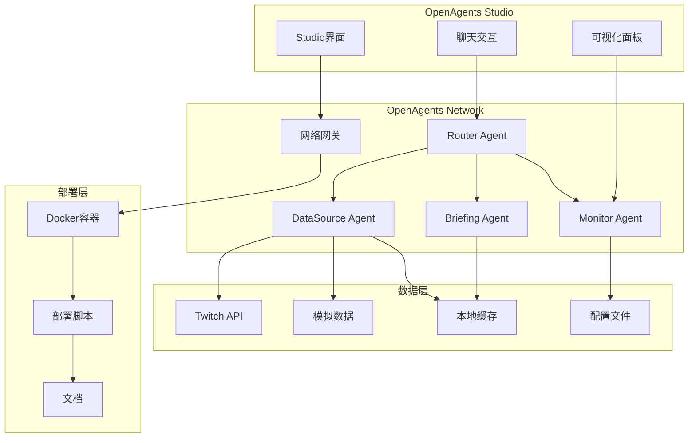

# Design Document: 小游探MVP版

## Overview

小游探MVP版专注于验证OpenAgents多Agent协作的核心能力，作为比赛项目展示OpenAgents框架的创新应用。设计原则：

- **OpenAgents优先**：充分利用OpenAgents框架特性
- **稳定可靠**：使用稳定数据源，确保演示效果
- **协作展示**：突出多Agent协作的创新性
- **快速部署**：支持一键部署和演示
- **扩展友好**：为后续功能扩展预留接口

## Architecture

### MVP架构图



### 核心设计决策

1. **数据源策略**：Twitch API + 模拟数据双保险
2. **Agent协作**：展示复杂查询的多Agent协作
3. **错误处理**：优雅降级，确保演示稳定性
4. **部署方式**：Docker容器化，一键启动

## Components and Interfaces

### 1. Router Agent（增强版）
**OpenAgents集成**：
```python
from openagents import WorkerAgent, Message, Context

class RouterAgent(WorkerAgent):
    def __init__(self):
        super().__init__(
            name="router",
            description="小游探路由中枢",
            capabilities=["intent_recognition", "task_routing", "result_aggregation"]
        )
    
    async def handle_message(self, message: Message, context: Context) -> Message:
        # 标准OpenAgents消息处理
        intent = await self.detect_intent(message.content)
        agents = self.select_agents(intent)
        results = await self.coordinate_agents(agents, message, context)
        return self.aggregate_results(results)
```

### 2. DataSource Agent（稳定数据源）
**多数据源支持**：
```python
class DataSourceAgent(WorkerAgent):
    def __init__(self):
        super().__init__(name="datasource")
        self.sources = [
            TwitchAPISource(),    # 主要数据源
            MockDataSource(),     # 备用数据源
            CacheSource()         # 缓存数据源
        ]
    
    async def get_data(self, query: DataQuery) -> DataResult:
        for source in self.sources:
            try:
                return await source.fetch(query)
            except Exception as e:
                logger.warning(f"Source {source} failed: {e}")
        return self.empty_result()
```

### 3. Briefing Agent（智能汇总）
**多Agent协作展示**：
```python
class BriefingAgent(WorkerAgent):
    async def generate_briefing(self, context: Context) -> Message:
        # 协调多个Agent获取数据
        live_data = await self.request_agent("datasource", "get_live_streams")
        trends = await self.request_agent("monitor", "get_trends")
        
        # 使用LLM生成智能摘要
        summary = await self.llm_summarize(live_data, trends)
        
        return Message(
            content=summary,
            metadata={"agents_used": ["datasource", "monitor"], "type": "briefing"}
        )
```

### 4. Monitor Agent（系统监控）
**实时状态监控**：
```python
class MonitorAgent(WorkerAgent):
    async def monitor_system(self) -> SystemStatus:
        return SystemStatus(
            agents_status=await self.check_all_agents(),
            data_sources=await self.check_data_sources(),
            performance=await self.get_performance_metrics()
        )
```

## Data Models

### OpenAgents标准消息格式
```python
@dataclass
class GameMessage(Message):
    query_type: str  # "live_status", "briefing", "trends"
    entities: Dict[str, Any]  # 提取的实体
    context: Dict[str, Any]   # 上下文信息
    
@dataclass
class AgentResponse(Message):
    agent_id: str
    processing_time: float
    confidence: float
    data: Dict[str, Any]
```

### 数据源抽象
```python
class DataSource(ABC):
    @abstractmethod
    async def fetch(self, query: DataQuery) -> DataResult:
        pass
    
    @abstractmethod
    async def health_check(self) -> bool:
        pass

class TwitchAPISource(DataSource):
    def __init__(self, client_id: str, client_secret: str):
        self.client = TwitchAPI(client_id, client_secret)
    
    async def fetch(self, query: DataQuery) -> DataResult:
        if query.type == "live_streams":
            return await self.client.get_streams(
                game_id=query.game_id,
                language=query.language
            )

class MockDataSource(DataSource):
    def __init__(self):
        self.mock_streams = [
            {"user_name": "Faker", "viewer_count": 45000, "game_name": "League of Legends"},
            {"user_name": "Doublelift", "viewer_count": 12000, "game_name": "League of Legends"}
        ]
    
    async def fetch(self, query: DataQuery) -> DataResult:
        # 返回模拟数据，确保演示稳定性
        return DataResult(data=self.mock_streams, source="mock")
```

## Correctness Properties

*A property is a characteristic or behavior that should hold true across all valid executions of a system-essentially, a formal statement about what the system should do. Properties serve as the bridge between human-readable specifications and machine-verifiable correctness guarantees.*

### Property Reflection

After reviewing the MVP requirements, I've identified key properties that focus on OpenAgents integration and system reliability:

**Core MVP Properties:**

**Property 1: OpenAgents Message Protocol Compliance**
*For any* inter-agent communication, messages should follow OpenAgents standard protocol format and be successfully delivered between agents
**Validates: Requirements 1.3**

**Property 2: Data Source Failover**
*For any* data request, if the primary API fails, the system should automatically switch to backup data sources and continue functioning
**Validates: Requirements 2.2, 2.5**

**Property 3: Agent Routing Intelligence**
*For any* user query, the Router Agent should correctly identify intent and route to appropriate agents based on query content
**Validates: Requirements 3.1**

**Property 4: Multi-Agent Result Aggregation**
*For any* complex query requiring multiple agents, the system should successfully coordinate agents and combine their outputs into coherent responses
**Validates: Requirements 3.3, 3.5**

**Property 5: Performance Response Time**
*For any* user query, the system should respond within 3 seconds regardless of data source or agent complexity
**Validates: Requirements 4.2**

**Property 6: Response Format Richness**
*For any* system response, the output should include structured formatting elements (emojis, links, organized text) to enhance user experience
**Validates: Requirements 4.3**

**Property 7: Error Handling and Recovery**
*For any* system error or agent failure, the system should handle gracefully, provide useful error messages, and attempt automatic recovery
**Validates: Requirements 5.2, 5.3, 5.5**

**Property 8: Logging and Monitoring**
*For any* system operation, detailed logs should be generated for debugging and monitoring purposes
**Validates: Requirements 5.1**

**Property 9: Configuration-Based Extensibility**
*For any* system configuration change (new agents, data sources), the system should adapt without requiring code changes
**Validates: Requirements 7.1, 7.2**

**Property 10: Agent Concurrency Support**
*For any* concurrent agent operations, the system should handle multiple agents processing simultaneously without conflicts
**Validates: Requirements 7.4**

## Error Handling

### MVP错误处理策略

#### 1. OpenAgents集成错误
```python
class OpenAgentsErrorHandler:
    async def handle_agent_failure(self, agent_id: str, error: Exception):
        logger.error(f"Agent {agent_id} failed: {error}")
        
        # 尝试重启Agent
        if await self.restart_agent(agent_id):
            return RecoveryAction.RESTARTED
        
        # 启用降级模式
        await self.enable_degraded_mode(agent_id)
        return RecoveryAction.DEGRADED
    
    async def handle_message_failure(self, message: Message, error: Exception):
        # 记录失败消息
        await self.log_failed_message(message, error)
        
        # 返回用户友好的错误信息
        return Message(
            content="抱歉，处理您的请求时遇到问题，请稍后重试。",
            metadata={"error": True, "original_error": str(error)}
        )
```

#### 2. 数据源错误处理
```python
class DataSourceManager:
    async def handle_api_failure(self, source: DataSource, error: Exception):
        # 标记数据源为不可用
        self.mark_source_unavailable(source)
        
        # 切换到下一个可用数据源
        next_source = self.get_next_available_source()
        if next_source:
            return await next_source.fetch(self.current_query)
        
        # 所有数据源都不可用，使用缓存
        return await self.get_cached_data()
```

#### 3. 演示保障机制
```python
class DemoSafetyNet:
    def __init__(self):
        self.demo_responses = {
            "live_query": "🔴 Faker正在直播《英雄联盟》，当前观众45,000人",
            "briefing": "📰 今日游戏圈简报：3位主播正在直播，总观众数12万人",
            "error": "系统正在处理您的请求，请稍等片刻..."
        }
    
    async def ensure_demo_success(self, query_type: str) -> str:
        # 确保演示时总有合理的回复
        return self.demo_responses.get(query_type, self.demo_responses["error"])
```

## Testing Strategy

### MVP测试重点

**OpenAgents集成测试**：
- Agent注册和发现
- 消息协议兼容性
- Studio界面集成
- 网络发布功能

**稳定性测试**：
- 数据源故障切换
- Agent异常恢复
- 长时间运行稳定性
- 并发处理能力

**演示场景测试**：
- 预设查询响应
- 复杂协作场景
- 错误处理展示
- 性能基准测试

### 测试配置

**属性测试框架**：使用 `hypothesis` 进行Python属性测试
**测试配置**：每个属性测试运行100次迭代
**标签格式**：`# Feature: yougame-mvp, Property {number}: {property_text}`

**测试数据管理**：
```python
class MVPTestData:
    @staticmethod
    def generate_demo_queries():
        return [
            "Faker在直播吗？",
            "生成今日游戏简报",
            "最近有什么热门游戏？",
            "帮我分析一下LOL的热度趋势"
        ]
    
    @staticmethod
    def generate_mock_streams():
        return [
            {"user": "Faker", "game": "League of Legends", "viewers": 45000},
            {"user": "Doublelift", "game": "League of Legends", "viewers": 12000},
            {"user": "Shroud", "game": "Valorant", "viewers": 8000}
        ]
```

通过这个MVP设计，我们专注于：
1. **OpenAgents框架的正确使用和集成**
2. **稳定可靠的演示效果**
3. **多Agent协作的创新展示**
4. **完整的部署和文档支持**

这样既满足了比赛要求，又确保了系统的稳定性和展示效果。