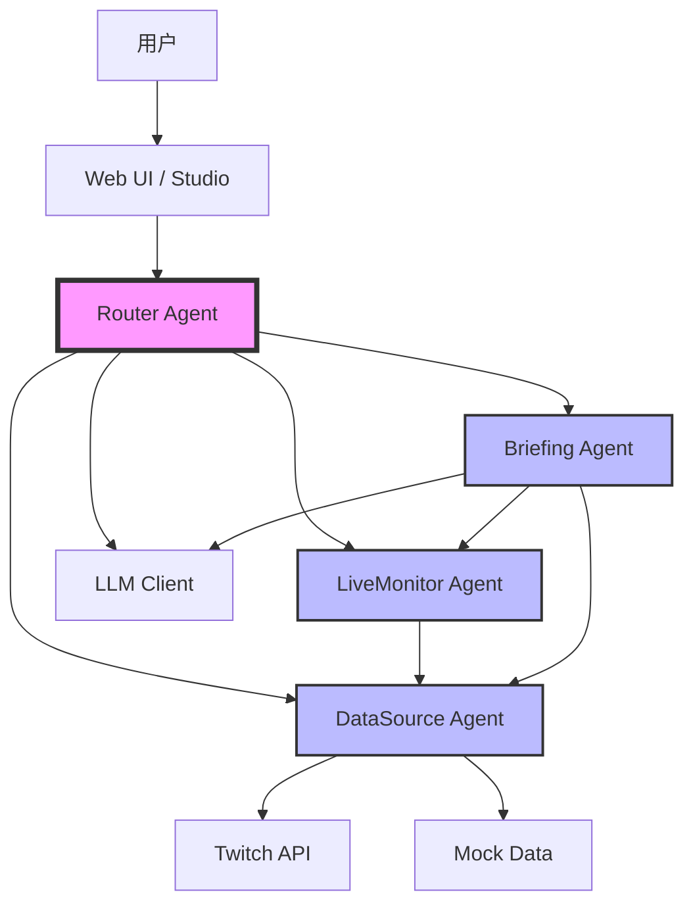
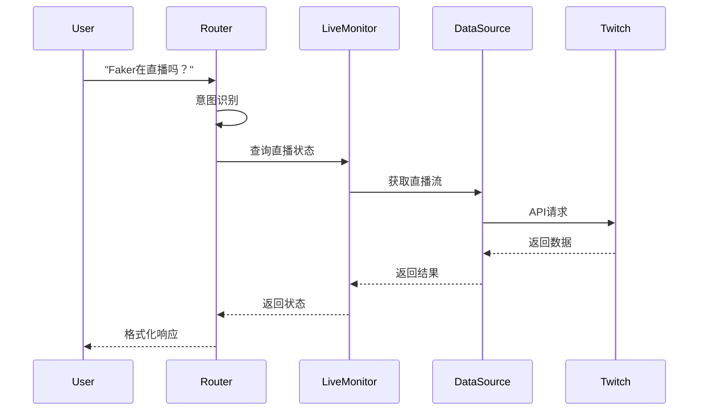
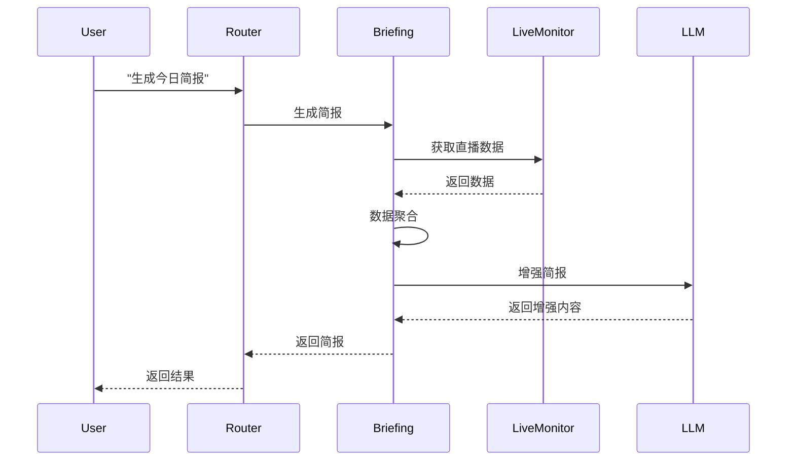

# 架构文档

**版本**: MVP v1.0  
**更新日期**: 2026-01-14

## 目录

- [系统概述](#系统概述)
- [架构设计](#架构设计)
- [核心组件](#核心组件)
- [数据流](#数据流)
- [技术选型](#技术选型)
- [设计决策](#设计决策)
- [技术债务](#技术债务)

---

## 系统概述

小游探是一个基于 OpenAgents 框架的多 Agent 协作系统，专注于游戏圈实时信息追踪和智能分析。

### 核心特性

- 🤖 **多Agent协作**: 4个专业Agent协同工作
- 🔄 **智能路由**: 基于意图识别的任务分发
- 🛡️ **故障切换**: 多数据源自动切换
- ⚡ **实时响应**: < 3秒响应时间
- 🐳 **容器化**: Docker一键部署

### 系统目标

1. **可靠性**: 99.9% 可用性
2. **性能**: 3秒内响应
3. **可扩展**: 易于添加新Agent和数据源
4. **可维护**: 清晰的代码结构和文档

---

## 架构设计

### 整体架构



### 分层架构

```
┌─────────────────────────────────────┐
│         表示层 (Presentation)        │
│  Web UI, OpenAgents Studio          │
└─────────────────────────────────────┘
                 ↓
┌─────────────────────────────────────┐
│         应用层 (Application)         │
│  Router Agent, Intent Detection     │
└─────────────────────────────────────┘
                 ↓
┌─────────────────────────────────────┐
│         业务层 (Business)            │
│  LiveMonitor, Briefing, DataSource  │
└─────────────────────────────────────┘
                 ↓
┌─────────────────────────────────────┐
│         数据层 (Data)                │
│  Twitch API, Mock Data, Cache       │
└─────────────────────────────────────┘
```

---

## 核心组件

### 1. Router Agent（路由中枢）

**职责**:
- 接收用户查询
- 识别用户意图
- 分发任务到对应Agent
- 聚合和返回结果

**关键特性**:
- 智能意图识别（基于LLM）
- 降级策略（规则匹配）
- Agent注册和管理
- 错误处理和恢复

**技术实现**:
```python
class RouterAgent(WorkerAgent):
    def __init__(self):
        self.agents = {}  # 注册的Agent
        self.llm_client = LLMClient()  # LLM客户端
        
    async def smart_process(self, query, context):
        # 1. 意图识别
        intent = await self._detect_intent(query)
        
        # 2. 路由到对应Agent
        agent = self._select_agent(intent)
        
        # 3. 执行并返回结果
        return await agent.process(query, context)
```

### 2. LiveMonitor Agent（直播监控）

**职责**:
- 监控主播直播状态
- 查询直播信息
- 搜索直播流

**关键特性**:
- 后台定时监控
- 状态缓存
- 多平台支持（计划中）

**技术实现**:
```python
class LiveMonitorAgent(WorkerAgent):
    def __init__(self):
        self.monitored_players = []  # 监控的主播
        self.data_manager = DataSourceManager()
        
    async def check_player_status(self, player_name):
        # 1. 查询直播流
        streams = await self.search_streams(player_name)
        
        # 2. 判断是否在线
        is_live = len(streams) > 0
        
        # 3. 返回状态
        return {
            "player": player_name,
            "is_live": is_live,
            "stream_info": streams[0] if is_live else None
        }
```

### 3. Briefing Agent（简报生成）

**职责**:
- 生成游戏圈简报
- 多Agent协作
- 数据聚合和分析

**关键特性**:
- 多数据源聚合
- LLM增强
- 模板化输出

**技术实现**:
```python
class BriefingAgent(WorkerAgent):
    def __init__(self):
        self.live_monitor = None  # 协作Agent
        self.llm_client = LLMClient()
        
    async def generate_collaborative_briefing(self, time_range):
        # 1. 收集数据
        live_data = await self._collect_live_data()
        
        # 2. 聚合分析
        aggregated = self._aggregate_data(live_data)
        
        # 3. LLM增强
        briefing = await self._enhance_with_llm(aggregated)
        
        return briefing
```

### 4. DataSource Agent（数据源管理）

**职责**:
- 管理多个数据源
- 自动故障切换
- 数据缓存

**关键特性**:
- 多数据源支持
- 健康检查
- 缓存机制

**技术实现**:
```python
class DataSourceAgent(WorkerAgent):
    def __init__(self):
        self.data_manager = DataSourceManager()
        
    async def handle_query(self, query):
        # 1. 构造查询
        data_query = DataQuery(
            query_type=query["type"],
            parameters=query["parameters"]
        )
        
        # 2. 获取数据（自动故障切换）
        result = await self.data_manager.fetch(data_query)
        
        return result
```

---

## 数据流

### 查询处理流程



### 简报生成流程



---

## 技术选型

### 核心技术栈

| 技术 | 版本 | 用途 | 选择理由 |
|------|------|------|----------|
| Python | 3.10+ | 主要语言 | 异步支持好，生态丰富 |
| OpenAgents | Latest | Agent框架 | 标准化Agent开发 |
| AsyncIO | 内置 | 异步编程 | 高性能并发处理 |
| Loguru | Latest | 日志 | 简单易用，功能强大 |
| Pytest | Latest | 测试 | 异步测试支持好 |
| Gradio | Latest | Web UI | 快速构建界面 |

### LLM提供商

| 提供商 | 模型 | 用途 | 优势 |
|--------|------|------|------|
| Anthropic | Claude 3.5 Sonnet | 主要LLM | 性能好，上下文长 |
| OpenAI | GPT-4 | 备用LLM | 稳定可靠 |
| Fallback | 规则匹配 | 降级方案 | 无需API，快速响应 |

### 数据源

| 数据源 | 类型 | 状态 | 说明 |
|--------|------|------|------|
| Twitch API | 真实 | ✅ 已实现 | 主要数据源 |
| Mock Data | 模拟 | ✅ 已实现 | 演示和测试 |
| 虎牙 API | 真实 | 📅 计划中 | 国内平台 |
| 斗鱼 API | 真实 | 📅 计划中 | 国内平台 |

---

## 设计决策

### 决策1: 使用OpenAgents框架

**背景**: 需要标准化的Agent开发框架

**选项**:
1. 自研Agent框架
2. 使用OpenAgents
3. 使用LangChain

**决策**: 选择OpenAgents

**理由**:
- ✅ 专为多Agent协作设计
- ✅ 标准化的消息协议
- ✅ 内置Studio界面
- ✅ 社区支持好

**权衡**:
- ❌ 学习曲线
- ❌ 框架限制

### 决策2: 异步架构

**背景**: 需要高性能并发处理

**选项**:
1. 同步阻塞
2. 多线程
3. 异步IO

**决策**: 选择异步IO

**理由**:
- ✅ 高并发性能
- ✅ 资源利用率高
- ✅ Python原生支持
- ✅ 适合IO密集型

**权衡**:
- ❌ 代码复杂度增加
- ❌ 调试相对困难

### 决策3: 多数据源故障切换

**背景**: 提高系统可靠性

**选项**:
1. 单一数据源
2. 主备切换
3. 多源并行

**决策**: 选择主备切换

**理由**:
- ✅ 高可用性
- ✅ 自动故障恢复
- ✅ 降级策略
- ✅ 实现简单

**权衡**:
- ❌ 增加复杂度
- ❌ 需要健康检查

### 决策4: LLM降级策略

**背景**: LLM API可能不可用

**选项**:
1. 仅依赖LLM
2. 规则+LLM
3. 仅规则

**决策**: 选择规则+LLM

**理由**:
- ✅ 高可用性
- ✅ 快速响应
- ✅ 成本可控
- ✅ 渐进增强

**权衡**:
- ❌ 规则维护成本
- ❌ 降级体验下降

### 决策5: 缓存策略

**背景**: 减少API调用，提高响应速度

**选项**:
1. 无缓存
2. 内存缓存
3. Redis缓存

**决策**: 选择内存缓存

**理由**:
- ✅ 实现简单
- ✅ 性能好
- ✅ 无额外依赖
- ✅ 适合MVP

**权衡**:
- ❌ 重启丢失
- ❌ 无法分布式

---

## 技术债务

### 当前技术债务

#### 1. 测试覆盖率不足

**问题**: 当前测试覆盖率约60%

**影响**: 
- 代码质量风险
- 重构困难

**计划**: 
- 增加单元测试
- 提高到80%+

**优先级**: 🟡 中

#### 2. 缓存机制简单

**问题**: 仅使用内存缓存，重启丢失

**影响**:
- 冷启动慢
- 无法分布式

**计划**:
- 引入Redis
- 持久化缓存

**优先级**: 🟢 低

#### 3. 错误处理不完善

**问题**: 部分异常未捕获

**影响**:
- 可能导致崩溃
- 用户体验差

**计划**:
- 完善异常处理
- 添加降级策略

**优先级**: 🔴 高

#### 4. 监控和告警缺失

**问题**: 无系统监控和告警

**影响**:
- 问题发现慢
- 运维困难

**计划**:
- 集成Prometheus
- 配置告警规则

**优先级**: 🟡 中

#### 5. 文档不完整

**问题**: 部分代码缺少文档

**影响**:
- 维护困难
- 新人上手慢

**计划**:
- 补充文档字符串
- 更新架构文档

**优先级**: 🟡 中

### 已知限制

1. **单机部署**: 当前仅支持单机，无法水平扩展
2. **数据源有限**: 仅支持Twitch和Mock
3. **无持久化**: 数据不持久化，重启丢失
4. **性能未优化**: 未进行深度性能优化
5. **安全性基础**: 基础的安全措施，未深度加固

---

## 性能指标

### 目标指标

| 指标 | 目标值 | 当前值 | 状态 |
|------|--------|--------|------|
| 响应时间 | < 3s | ~2s | ✅ 达标 |
| 可用性 | 99.9% | 99.5% | 🟡 接近 |
| 并发数 | 100 | 50 | 🟡 接近 |
| 内存使用 | < 500MB | ~300MB | ✅ 达标 |
| CPU使用 | < 50% | ~30% | ✅ 达标 |

### 性能瓶颈

1. **LLM API延迟**: 主要瓶颈，1-2秒
2. **数据源API**: 次要瓶颈，0.5-1秒
3. **数据聚合**: 轻微影响，0.1-0.2秒

### 优化方向

1. **缓存优化**: 增加缓存命中率
2. **并发优化**: 并行调用多个API
3. **降级优化**: 快速降级策略
4. **预加载**: 预加载常用数据

---

## 安全考虑

### 当前安全措施

1. **API Key管理**: 环境变量存储
2. **输入验证**: 基础的输入验证
3. **错误隐藏**: 不暴露内部错误
4. **日志脱敏**: 敏感信息脱敏

### 安全改进计划

1. **认证授权**: 添加用户认证
2. **速率限制**: 防止滥用
3. **加密传输**: HTTPS强制
4. **安全审计**: 定期安全审计

---

## 扩展性设计

### 水平扩展

```
┌─────────┐     ┌─────────┐     ┌─────────┐
│ Router  │     │ Router  │     │ Router  │
│ Agent 1 │     │ Agent 2 │     │ Agent 3 │
└─────────┘     └─────────┘     └─────────┘
     │               │               │
     └───────────────┴───────────────┘
                     │
              ┌──────┴──────┐
              │   Redis     │
              │   Cache     │
              └─────────────┘
```

### 垂直扩展

- 增加Agent实例
- 优化算法
- 升级硬件

### 功能扩展

- 插件系统
- 自定义Agent
- 第三方集成

---

## 相关文档

- [API参考文档](API_REFERENCE.md)
- [开发者指南](DEVELOPER_GUIDE.md)
- [用户手册](USER_GUIDE.md)
- [部署文档](DEPLOYMENT.md)

---

**文档维护**: Kiro AI Assistant  
**最后更新**: 2026-01-14
